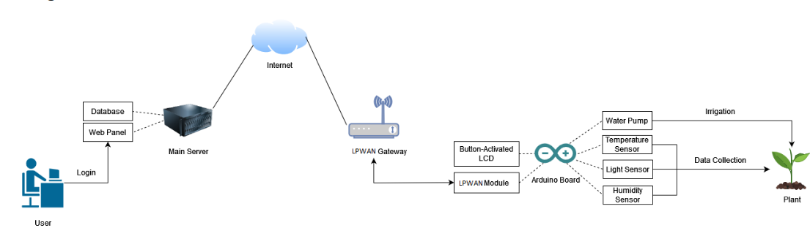

# INF535 - Plant Companion

- Group Members : Chinonso Stanislaus Ngwu, Hadi Rayan Al-Sandid
- Front-End uses the 'startbootstrap-sb-admin-2' designed by David Miller. The original Github repository is available [here](https://github.com/startbootstrap/startbootstrap-sb-admin-2).

## Description:
- The Plant Companion is an Arduino-based system that uses sensors to collect data relevant to maintaining a plant & irrigates the plant when necessary to do so. Data about soil humidity, soil temperature, and light intensity is collected by the sensors.
- This data will be used to (1) automatically water the plant if needed, with a local water pump; (2) warn users of any abnormality in environment which could affect the plant

## Target Features:
- Energy-Efficient: The Plant Companion implements Watchdog-based Duty Cycling, so that it performs its measurements & contacts a main server periodically, before going into sleep mode to conserve energy.
- Server Connection: The Plant companion will connect to the internet using an LPWAN technology (LoRa, Zigbee...), and communicate with a main server. It will send upstream sensor data and receive downstream configuration data. Users can access information on the status of their plants through a web portal.
- Soil Humidity Control: The Plant Companion will detect if soil humidity becomes unfavorable. In this case, it will attempt to irrigate the plant automatically by activating a water pump.
- Alert System: If environmental factors become very unfavorable (high temperature, soil humidity is not rectifiable, low light intensity), a warning message will be sent to the server.
- Battery Powered: The Plant Companion runs on a battery. Battery level is not tracked, but if the main server receives no updates for a period, a warning is issued.
- Plant-Dependent Parameters: Each plant type has different needs when it comes to soil humidity and soil temperature. The user must specify which type of plant is attached to his Plant Companion at activation so that proper decisions can be taken. (For our prototype, only three generic plant types will be provided).
- LCD Display: Our Plant Companion comes with an LCD display attached to show the most recent measurements. The LCD display is off by default to save power, but can be enabled temporarily by pressing a button

## In-Discussion Features
- Determining Plant Health through Leaf color : We'd like to estimate Plant Health directly by looking at the color of a leaf on the plant. For our simple prototype, we would take three preset color profile (i.e. Plant A has green leaves when healthy, and other colors when unhealthy. Plant B, Plant C...). A message is sent to users when an issue is detected.
