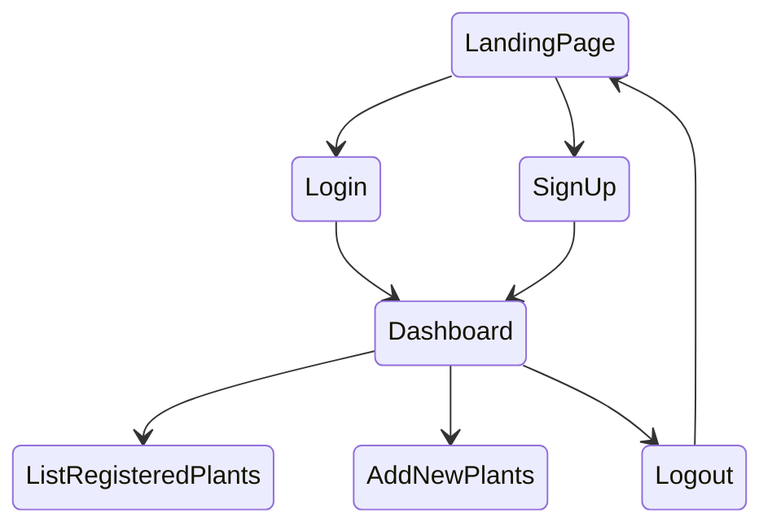

## Cool Stuff for the Report

- (1) Do a State machine for the main components
  - ESP Board
  - Server
- (2) Re-do a cool diagram with everything
- (3) Motivation on "Why ESP and not Arduino ?"
  - Arduino doesn't support Wi-Fi, so we are going with ESP
  - Has cached memory : When turned off / reset it can keep some kind of state.
- (4) The ATmega328P datasheet can be found [here](https://ww1.microchip.com/downloads/en/DeviceDoc/Atmel-7810-Automotive-Microcontrollers-ATmega328P_Datasheet.pdf)
- (5) Questions to address :
  - Why didn't we use MQTT ?
  - Why did we go for Wi-Fi, rather than other technologies (Bluetooth, LPWAN..) ?

## (ESP) Main Routine & Data Collection

- (1) Whenever we flash code to our board, it is in "pre-initialization" mode. It will send a special message to the server telling it it has not been initialized yet. The board will periodically send this message and go back to sleep (following the same pattern as used regularly). Whenever the board receives a valid message containing plant parameters it passes into "active stage". The plant parameters are saved to local memory (i.e. if the board is reset, it doesn't send go back into "pre-initialization" mode, but rather uses the saved values).
- (2) Duty-cycling using watchdog timer / regular timer
  - Have an LED that blinks quickly whenever we have an interrupt
  - Use a variable inside the timer to expand the time we can count with these interrupts (i.e. max Side timer timer is 8 second; count 1000 times -> 8*1000 seconds total time)
- (3) Reading Soil Moisture values from the Soil moisture sensor.
- (4) Reading ambient humidity and ambient temperature from the DHT11 sensor
- (5) Reading light values using LDR.
- (6) Collect color data on a specific leaf using a color sensor.
- (7) Button-Activated LCD, which displays local values for 5 seconds (-> can be configured).
- (8) Simulate water pump/actuator using an LED. It will activate when the right parameters are present (Soil Moisture). It will stay on for the simulated duration of irrigation (5 seconds).
- (9) System is battery-connected. Experiment with connecting sensors to a battery-powered system, and see what load it can take, or how to split the load.

## (ESP) Communication

- (1) Convert our data on the ESP (Soil Moisture, Temperature, Humidity, Light Value, Color Sensor) to JSON format.
- (2) Connect to the Wi-Fi
- (3) Send HTTPS request to our server with updated plant information (i.e. Emphasis on HTTPS for security)
- (4) After sending HTTPS request with updated info, wait 5 seconds (configurable), if we receive an HTTPS request from the server, update data accordingly and go back to sleep. If nothing is received in the 5 seconds interval, do nothing and go back to sleep.

## (Server) Web-Panel & Server-side Actions

- (1) Let the user create an account, where he specifies mail and password. He can then login to access a personal space on the web-panel, which allows him to register new plant companions, as well as view data about his current registered plant companions (Temperature, Humidity, Light, Soil Moisture).  View the Front-End Dashboard section for more details. 
- (2) Let the user register a plant companion. He is required to provide an ID for the plant companion, as well as the plant type it is associated to (Plant Type A/Plant Type B/Plant Type C). The plant ID needs to be in the database of the server (i.e. the associated plant companion needs to be in "pre-initialization" mode, or waiting for plant configuration data).
- (3) If the user has modified the configuration data of the Plant Companion on the web panel, send a request to the Plant Companion AFTER BEING CONTACTED.
- (4) If the Plant Companion does not contact after a certain period of time (i.e. 1min for the prototype), then display an error message on the web panel that warns that there is an issue (low battery, no connection, damage to board) & also send a mail to the user (use the mail he registered with). 
- (5) When a request is received from a Plant Companion, update the values on the database & web-panel. Make sure that the input is sanitized & does not try to mess with our back-end / SQL Injection.
- (6) When a request is received from a Plant Companion, if the new values are not optimal for the plant health, we display a warning message on the panel and send a mail to the user.

## (Server) Front-End Dashboard Organization

